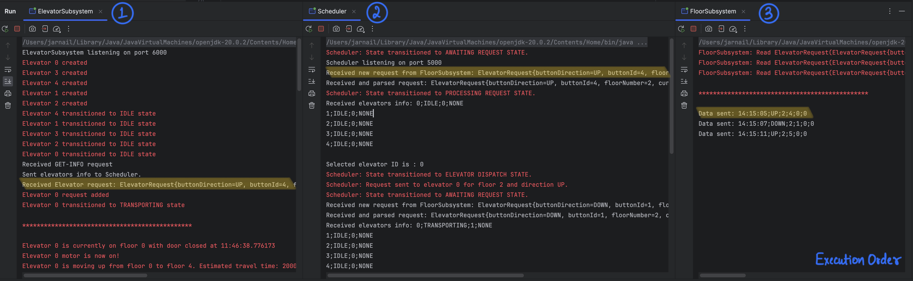

# Java Elevator Simulation Project (SYSC-3303)

## Description
The goal of this project is to simulate an elevator system and showcase how elevators, floors, and a scheduler work together to handle elevator requests efficiently. The system uses a CSV parser to read input requests and a logging system to debug and monitor the process. The system is composed of three important components: a multithreaded controller (Scheduler), an elevator car simulator (with lights, buttons, doors, and motors), and a floor simulator (with buttons, lights, and simulated people)

## Installation
- Ensure Java OpenJDK 20.0.2 is installed on your system. 
- Clone this repository and navigate into the project directory.
- Compile the Java files using your preferred IDE that supports Java. That said, it is recommended to use IntelliJ IDEA 2023.2.5 (Community Edition) for best results. 

## Usage
- First start `ElevatorSubsystem.java`, then `Scheduler.java` and at the end `FloorSubsystem.java`. The FloorSubsystem will start the GUI.
- Input requests can be modified in the CSV file specified by `input.csv` in the res folder.
- To execute all tests, right-click on the test folder and select 'Run Tests in 'test''

## Components
- **config**
  - `Config.java`: Defines constants used across the system, such as the time required to load/unload passengers and to open/close elevator doors, as well as the speed of the elevator. 

- **elevator**
  - `Elevator.java`: Defines the elevator's properties and actions.
  - `ElevatorSubsystem.java`:  Manages the scheduling and coordination of multiple elevators.
  - `ElevatorState.java`:  Defines the possible states an elevator can be in (e.g., idle, transporting).
  - `ElevatorIdleState.java`:  Implements the behavior of an elevator waiting for new requests.
  - `ElevatorTransportingState.java`: Implements the behavior of an elevator actively moving and handling requests.
  - `ElevatorInfo.java`:  Stores information about an elevator's current state for communication purposes.
  - `ElevatorFaultState.java`: Represents the fault state of an elevator. It clears the request queue, stops the elevator at the nearest floor, opens the doors, displays an error message, and logs relevant information when the elevator enters the fault state.

- **floor**
  - `CSVParser.java`: Parses elevator request data from a CSV file into a list of `ElevatorRequest` objects. 
  - `ElevatorRequest.java`: Defines the data structure for an elevator request, including the requested direction, floor number, and time of the request.
  - `FloorSubsystem.java`: Acts as the manager for all floor-related activities. It reads elevator requests from a CSV file using CSVParser, stores these requests, and communicates with the Scheduler to coordinate the handling of these requests. The subsystem manages an array of Floor objects representing the floors in the building.
  - `Floor.java`: Represents an individual floor within the building. It maintains the state of the floor's lamps (indicating if an up or down request has been made).

- **GUI**
  - `Elevator.java`: A graphical representation of an Elevator, including its doors
  - `ElevatorJob.java` and `ElevatorJobType.java`: Contains the Elevator jobs' type and data
  - `Floor.java`: Contains the graphical representation of the Floors, including the corridors which hold and display the number of passengers waiting (left) and unloaded (right)
  - `GUI.java`: The class containing the logic to display the graphical user interface, and receiving updated information from the FloorSubsystem and parsing it on the GUI in real-time.
  - `Lamp.java`: This class represents the lamps indicating elevator calls on each floor.
  - `Number.java`:This classhandles displaying numerical values on the GUI, such as the number of waiting or unloaded passengers.
  - `Resource.java`, `ResourceLoader.java`, `ResourceHelper.java` and `ResourceType.java`: These classes collectively manage the loading, manipulation, and rendering of graphical resources (images) used in the GUI.
  - `Window.java`: The class extending JFrame and setting up the main application window.

- **log**
  - `Log.java`: Provides a static method, print, for logging informational messages, which is used throughout the project to log events, operations, and errors.

- **main**
  - `Main.java`: The entry point of the application. It orchestrates the starting of all subsystems and manages their execution threads.

- **scheduler**
  - `Scheduler.java`: The main class of the scheduler. It manages the queue of requests, communicates with the ElevatorSubsystem and FloorSubsystem, and implements the state machine logic for request processing.
  - `SchedulerState.java` : Interface defining the possible states of the Scheduler (e.g., AwaitingRequestState, ProcessingRequestState, ElevatorDispatchState). Each state implements specific request handling behavior.
  - `AwaitingRequestState.java` : A concrete implementation of the SchedulerState interface, representing the state where the Scheduler is idle and waiting for new requests.
  - `ProcessingRequestState.java`: Another implementation of SchedulerState, representing the state where the Scheduler is actively analyzing a received request to determine the best elevator assignment.
  - `ElevatorDispatchState.java` : A SchedulerState implementation responsible for the state where an elevator has been selected and the Scheduler communicates the request to the ElevatorSubsystem.
  

- **test**
  - `CSVParserTest.java`: Tests the functionality of the CSV parser to ensure reliability.
  - `FloorSubsystemTest.java`: Tests the functionality of the floor subsystem.
  - `SchedulerTest.java`: Tests the functionality of the scheduler.
  - `TestElevator.java`: Tests the functionality of the elevator class.
  - `TestElevatorSubsystem.java`: Tests the functionality of the elevator subsystem.
  - `TestFloor.java`: Tests the functionality of the floor class.
  - `TestFaults.java`: Tests for handling various faults in the elevator system, including BAD_REQUEST, DEATH, DOOR_NOT_CLOSE, DOOR_NOT_OPEN, and timeout faults.

## Contributing - Group 7 (Lab A1)
- Ali Abdollahian (101229396) 
- Jaan Soulier  (101189819)
- Jarnail Singh (101228231)
- Laurence Lamarche-Cliche (101173070) 
- Matthew Gaudet (101193256)

## Team Contributions for Iteration 5

- Ali Abdollahian
  - Added the capacity limits logic inside an Elevator

- Jaan Soulier
  - Created the Graphical User Interface, parsing information from the FloorSubsystem and updating the GUI accordingly, including loading and unloading passengers, opening and closing doors and displaying two different types of faulty states.
  
- Jarnail Singh
  - ElevatorSubsystem, ElevatorTransportingState will send a signal to FloorSubsystem on port 12345 containing “fault, ElevatorId and floor it happened on” at the moment the transient fault (“DOOR NOT OPEN/ CLOSE”)  or  Hard Fault (“DEATH”) is encountered.
  - Created new UDP methods in the ElevatorSubsystem to send information to the FloorSubsystem, to update the GUI properly.
  
- Laurence Lamarche-Cliche
  - Performed extensive GUI testing
  - Added error handling code in the Elevator States
  - Added tests for UDP between the three subsystems

- Matthew Gaudet
  - Added instrumentation code to measure our Elevator System's performance
  - Update transporting timeout to depend on the number of floors to move rather than a hard-coded value.
